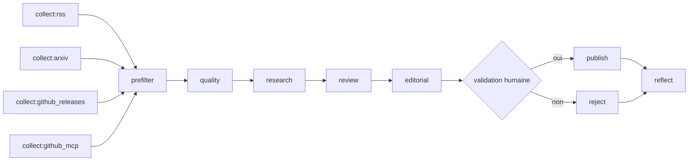

# Architecture — LLM Watch Harness

> Une veille LLM/GenAI **factuelle et sourcée**, produite par des agents IA… tenus en laisse.

Le projet a **deux étages d'IA** qui ne font pas le même métier :

| Étage | Qui | Rôle | Analogie |
|:--|:--|:--|:--|
| **1. Harness Claude Code** | Claude (dans l'IDE / le terminal) | Développe, pilote et audite le projet | Le rédacteur en chef et son équipe technique |
| **2. DAG LangGraph** | Petit modèle local (Ollama) ou API | Produit la veille chaque jour | La chaîne de fabrication du journal |

Idée centrale, valable aux deux étages : **le LLM propose, le code dispose.**

---

## 1. Le Harness côté Claude Code

Un *harness* (harnais), c'est tout ce qu'on met **autour** du modèle pour qu'il reste utile et sans
danger : des règles, des outils autorisés, des contrôles automatiques et de la mémoire. Claude reste
libre de raisonner, mais il avance sur des rails.

```
                ┌───────────────────────── Session Claude Code ─────────────────────────┐
 SessionStart ─►│ contexte : CLAUDE.md + mémoire de veille + état des runs              │
                │                                                                       │
 PreToolUse ───►│  Claude veut agir ──► guard.py ──► ✔ exécuté  /  ✘ refusé (+ raison)  │
                │        │                                                              │
                │        ├─ outils MCP (GitHub lecture seule, Notion borné, Playwright) │
                │        ├─ skills (procédures métier)                                  │
                │        └─ sous-agents (auditeurs spécialisés)                         │
 PostToolUse ──►│  après une édition : compilation Python, rappel migrations            │
 Stop ─────────►│  pytest : tests rouges = Claude ne peut pas s'arrêter                 │
                └───────────────────────────────────────────────────────────────────────┘
```

### 1.1 Les briques

| Brique | Fichier(s) | Ce qu'elle apporte |
|:--|:--|:--|
| **Règles** | [CLAUDE.md](CLAUDE.md) | La « constitution » : ne rien inventer, tout sourcer, Pydantic avant persistance, migrations testées, pas de secret dans Git. |
| **Mémoire** | [.claude/memory/veille.md](.claude/memory/veille.md) | Généré par `memory --export` : leçons des validations humaines, centres d'intérêt (Grill-me), santé des sources. Claude « se souvient » d'une session à l'autre. |
| **Permissions** | [.claude/settings.json](.claude/settings.json) | Liste blanche (pytest, doctor, lecture MCP…) et interdiction de lire/écrire `.env`. |
| **Hooks** | [.claude/hooks/](.claude/hooks/) | Contrôles **déterministes**, exécutés par la machine, pas par la bonne volonté du modèle (voir 1.2). |
| **MCP** | [.mcp.json](.mcp.json) | Outils externes : `github-scout` (lecture seule), `notion-veille` (écriture bornée à la page de veille), `notion`, `playwright`. |
| **Skills** | [.claude/skills/](.claude/skills/) | Procédures métier prêtes à l'emploi : `rapport-veille`, `audit-digest`, `ajout-source`, `review-actu`, `grill-me`, `github-scout`, `veille-tech`. |
| **Sous-agents** | [.claude/agents/](.claude/agents/) | Auditeurs à outils restreints : `schema-auditor`, `security-auditor`, `source-auditor`, `github-scout`. |
| **Output style** | [.claude/output-styles/python-app-dev.md](.claude/output-styles/python-app-dev.md) | Posture de dev Python avec les contraintes de la Jetson Orin 8 Go. |

### 1.2 Les quatre hooks

| Moment | Script | Effet |
|:--|:--|:--|
| `SessionStart` | [session_context.py](.claude/hooks/session_context.py) | Injecte l'état de la veille (documents, runs en attente de validation). |
| `PreToolUse` | [guard.py](.claude/hooks/guard.py) | Bloque `rm -rf`, `git push --force`, `DROP TABLE`, `curl … \| sh`, lecture/écriture de `.env`, fuites de secrets. |
| `PostToolUse` | [post_edit.py](.claude/hooks/post_edit.py) | Compile le `.py` édité ; rappelle la règle « migration + test » si `storage.py` change. |
| `Stop` | [stop_tests.sh](.claude/hooks/stop_tests.sh) | Lance `pytest` : **des tests rouges empêchent Claude de déclarer la tâche finie**. |

> Vulgarisé : CLAUDE.md dit « ne fais pas ça » ; les hooks **empêchent** de le faire.
> Une règle écrite peut être oubliée, un hook ne l'oublie jamais.

---

## 2. Le DAG LangGraph (la chaîne de production)

Le pipeline de veille vit dans [app/workflow/](app/workflow/). Il combine deux idées :

- un **Task Graph** : le plan est une *donnée* validée par Pydantic (ids uniques, dépendances
  connues, pas de cycle) — [tasks.py](app/workflow/tasks.py) ;
- un **Supervisor** : un chef d'orchestre qui, à chaque tour, regarde quelles tâches sont prêtes et
  délègue — [graph.py](app/workflow/graph.py).

### 2.1 Le plan par défaut



`python -m app.main plan --langgraph` affiche le plan réel.

### 2.2 Le rôle de chaque étape

| Étape | LLM ? | Ce qu'elle fait |
|:--|:--:|:--|
| **collector** ×4 | non | Collecte **en parallèle** (`Send`). Une source en panne est isolée : tâche optionnelle, le run continue. |
| **prefilter** | non | Déjà publié ? trop vieux ? hors mots-clés ? Puis tourniquet entre sources (arXiv n'écrase pas les releases). |
| **quality** | non | Sous-graphe `bruit → doublons → sélection` ([quality.py](app/workflow/quality.py)) : écarte tutoriels, commits `chore`, quasi-doublons. |
| **research** | **oui** | Map-reduce : un *Scout* par lot de documents, puis ranking hybride explicable (score /100 + raisons). |
| **review** | parfois | Pré-contrôle automatique (date future ⇒ rejet sans appel), puis *Critic* LLM **seulement si nécessaire**. |
| **editorial** | **oui** | *Editor* rédige le digest → guards de publication → réparation si violation (nombre de tours borné). |
| **approval** | — | `interrupt()` : le graphe **s'arrête** et attend l'humain (`resume --approved/--rejected`). |
| **publish** | non | Digest Markdown/JSON, rapport daté, Notion. |
| **reflect** | non | Mémorise la leçon de l'humain et ajuste les thèmes préférés ; ré-exporte `veille.md`. |

Les sous-agents (`quality`, `research`, `review`, `editorial`) sont des **sous-graphes** avec leur
propre état : ils ne renvoient au graphe parent que ce qui est prévu — [subagents.py](app/workflow/subagents.py).

### 2.3 Décisions du Supervisor

- tâches prêtes = collecteurs → **fan-out parallèle** ; sinon délégation une par une ;
- trop peu de signaux retenus → **relance** de `research` avec un seuil assoupli (nombre de relances borné) ;
- échec d'une tâche obligatoire → `failed` ; violation des guards → `blocked` ;
- plan terminé → `approval`.

### 2.4 Robustesse

- **Checkpoint SQLite** : un run interrompu (validation humaine, crash) reprend là où il s'était arrêté.
- **RetryPolicy** : erreurs réseau/Ollama retentées (2 tentatives au total) ; au-delà, l'erreur devient un **état**
  (`failed`) et le Supervisor décide, au lieu d'un crash.
- **Traces** : table `traces` + page `/trace/<id>`, Langfuse/LangSmith en option.

---

## 3. Agentic vs Harness — la version simple

**Un agent**, c'est un LLM à qui on laisse **choisir** la prochaine action (quel outil appeler, quoi
garder, quoi écrire). C'est puissant, mais un LLM peut halluciner une URL, inventer une date ou
obéir à une consigne cachée dans une page web.

**Le harness**, c'est l'ensemble des garde-fous qui rendent cette liberté sûre. Dans ce projet, le
partage des rôles est net :

| Le LLM décide… | Le code impose… |
|:--|:--|
| quels documents sont pertinents (il renvoie des **identifiants**) | l'URL, le titre et la date, **recopiés depuis les documents collectés** |
| le verdict du Critic | le rejet automatique d'une date future, que le LLM ne peut pas lever |
| la rédaction du digest | la validation Pydantic, les guards de publication, la boucle de réparation bornée |
| — | la validation humaine avant toute publication |

Les garde-fous sont posés à trois niveaux ([guards.py](app/harness/guards.py), [hooks.py](app/harness/hooks.py)) :

1. **Entrée** — `sanitize_untrusted` neutralise les injections de prompt dans les contenus collectés ;
   `mcp_guard` n'autorise que les outils MCP en lecture seule et borne leurs arguments.
2. **Graphe** — `node_contract` : chaque nœud ne peut écrire que les clés déclarées, validées par Pydantic.
3. **Sortie** — guards de publication : chaque affirmation rattachée à une URL connue, pas d'URL
   inventée dans le texte, dates cohérentes, aucun secret, digest non vide.

Et une boucle d'apprentissage ferme le tout :

```
humain valide/rejette ──► reflect (Store LangGraph) ──► veille.md ──► Claude Code + prochain run
```

> En une phrase : **les agents apportent le jugement, le harness apporte la confiance.**
