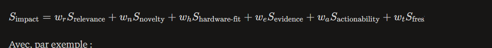

# Projet : LLM Watch Harness

Ton application est déjà bien au-delà d’un prototype de veille : elle a un double harness Claude Code + application, un DAG LangGraph piloté de façon déterministe, des sous-graphes spécialisés, une interruption humaine avant publication, des guards multicouches, trois mémoires, des MCP read-only, une UI SSE, de l’observabilité et environ 150 tests.


## Fondations
| Bloc              | Existant                                                                                                                  |
| ----------------- | ------------------------------------------------------------------------------------------------------------------------- |
| Orchestration     | Supervisor + Task Graph validé par Pydantic, fan-out parallèle des collecteurs, Command(goto=…), reprise avec checkpoints |
| Sources           | RSS, arXiv, GitHub Releases et GitHub via MCP                                                                             |
| Agents            | Scout en map-reduce, Critic, Editor, puis reflect pour la mémoire                                                         |
| Fiabilité         | Schémas JSON, contrats de nœuds, retry, budgets LLM, guards publication, réparations bornées                              |
| Human-in-the-loop | interrupt() avant publication, décision publier/rejeter, note transformée en leçon                                        |
| Mémoire           | SQLite factuel, SqliteStore LangGraph, export Markdown consommé par Claude Code                                           |
| DX                | Claude Code avec skills, sous-agents, hooks, CLAUDE.md, MCP et politique de permissions                                   |
| Observabilité     | Langfuse + LangSmith, traces de chat et de runs, métadonnées de session                                                   |
| UX                | Chat sourcé, SSE, recherche FTS5/BM25, veille ciblée, sélection/citation de texte, rapports HTML/Markdown, Notion         |

# Garantie
Ton principe — le LLM choisit et rédige, le code garantit — est exactement celui qu’il faut garder. Le LLM ne fabrique ni URL ni métadonnée : il pointe vers les documents collectés, puis le code reconstruit le résultat vérifiable.
index.html


## Mémoire et apprentissage
Ta boucle actuelle “rejet humain → leçon → injection dans les prompts → règle déterministe si nécessaire” est excellente.

## Observabilité

Tu as Langfuse et LangSmith activables. 
Langfuse est généralement le meilleur candidat si tu veux instrumenter prompts, coûts, sessions, traces et potentiellement auto-héberger. 

Utilise LangSmith surtout si tu exploites fortement les outils d’évaluation et datasets LangChain/LangGraph.


# Ameliorations


Roadmap priorisée

## Phase 1 — Qualité du signal
Ajouter snapshots et versionnement de documents.

Implémenter déduplication sémantique et clustering d’événements.

Ajouter score d’autorité, fraîcheur, nouveauté et impact.

Afficher le détail des scores dans la UI.

Ajouter les feedbacks : utile, à tester, à surveiller, déjà connu, bruit, incorrect.

Résultat : moins de bruit, des signaux plus explicables, une base de dataset d’évaluation.

## Phase 2 — Claims et preuves
Ajouter claims, evidence, contradictions.

Construire un sous-graphe evidence.

Imposer une citation/extrait source pour chaque claim important.

Distinguer fait, analyse et hypothèse dans l’Editor.

Ajouter un score de confiance affichable dans le rapport.

Résultat : des digests plus fiables, plus lisibles et auditables.

## Phase 3 — Apprentissage et personnalisation
Créer un profil d’impact versionné.

Implémenter une mémoire avec types, provenance, confiance et expiration.

Ajouter un système de suggestion de règles après feedbacks récurrents.

Mettre en place la sélection diversifiée des signaux.

Exposer une page “Pourquoi cette veille ?”.

Résultat : une veille réellement adaptée à tes priorités GenAI/LLM/GPU.

## Phase 4 — Research-to-Experiment
Ajouter le statut test.

Générer les Experiment Cards.

Ajouter exécution sandboxée et collecte de métriques.

Comparer les résultats à une baseline.

Promouvoir le résultat final dans la Knowledge Base.

Résultat : la veille devient un système de décision et d’expérimentation, pas une lecture passive.

## Phase 5 — Intelligence continue
Source health adaptative.

Veille delta / changelog intelligence.

Alertes à haute valeur avec seuils et cooldowns.

Knowledge graph léger : projets, versions, modèles, benchmarks, GPU, claims.

Génération de roadmap trimestrielle basée sur signaux validés et résultats d’expérimentation.

Résultat : une plateforme personnelle de veille et d’intelligence technique.

Le meilleur prochain sprint
Je lancerais ce sprint précis :

Ajouter event_clusters et event_cluster_members.

Créer une déduplication hybride : URL/hash, titre normalisé, puis similarité sémantique.

Ajouter un score explicable : pertinence, fraîcheur, autorité, nouveauté, impact.

Ajouter 5 boutons de feedback dans l’UI.

Persister ce feedback dans SQLite et dans ton Store LangGraph.

Créer 30 cas d’évaluation annotés issus de vraies veilles.

Faire apparaître dans le digest pourquoi chaque signal a été retenu.


------


Top fonctionnalités à forte valeur

### 1. Signal Intelligence : événements plutôt que documents

Aujourd’hui, tes documents sont surtout dédupliqués par URL et titre normalisé. Le plus gros saut qualitatif serait de créer un objet métier Event/Signal Cluster.

Un même événement peut produire :

- Une release officielle GitHub.
- Un changelog de documentation.
- Une PR associée.
- Un article de blog.
- Un benchmark communautaire.
- Une issue de régression.

Un papier arXiv qui formalise l’approche.

```text
Documents collectés
  ↓
Déduplication exacte
  ↓
Similarité sémantique + titres + entités
  ↓
Cluster d'événement
  ↓
Extraction de claims atomiques
  ↓
Validation par sources indépendantes
  ↓
Signal priorisé et publié
```

### 2. Graphe de claims et preuves

Puis impose dans le rapport :

- Chaque fait technique important doit avoir au moins une preuve.

- Chaque benchmark doit préciser matériel, modèle, batch, contexte, version et méthode.

- Toute phrase interprétative est explicitement marquée comme telle.

- Une source secondaire ne suffit pas pour déclarer une information comme “confirmée”.

- Une contradiction doit apparaître, pas être masquée par la synthèse.

```text

accepted signals
  ↓
claim_extract
  ↓
claim_ground
  ↓
cross_source_verify
  ↓
contradiction_detect
  ↓
evidence_score
  ↓
editorial

```

L’Editor ne reçoit plus seulement un digest de textes : il reçoit des facts structurés, sourcés et scorés.

Cela protège particulièrement contre la limite que tu as déjà identifiée : avec un petit modèle local, l’Editor peut paraphraser au-delà de l’extrait, même si les guards couvrent les URLs, dates et secrets.
index.html

### 3. “Pourquoi c’est important pour moi ?”

Ton système possède déjà une mémoire de thèmes privilégiés, exclusions et leçons humaines. Transforme-la en un profil d’impact versionné.

profiles/julien.toml

```toml
[identity]
role = "Python / GenAI / LLM infrastructure engineer"
language = "fr"

[priorities]
topics = [
  "LLM inference",
  "vLLM",
  "TensorRT-LLM",
  "SGLang",
  "llama.cpp",
  "MCP",
  "agentic systems",
  "RAG evaluation",
  "GPU optimization",
  "Kubernetes",
  "open-weight models"
]

[hardware]
gpus = ["NVIDIA RTX 3070 Ti 8 GB"]
platforms = ["WSL2", "Linux", "Jetson Orin 8 GB"]

[preferences]
favor = [
  "open source",
  "reproducible benchmark",
  "local inference",
  "Python ecosystem",
  "self-hosted"
]

avoid = [
  "generic tutorials",
  "marketing-only announcements",
  "unverifiable performance claims"
]
```

Puis calcule un score d’impact explicable :

