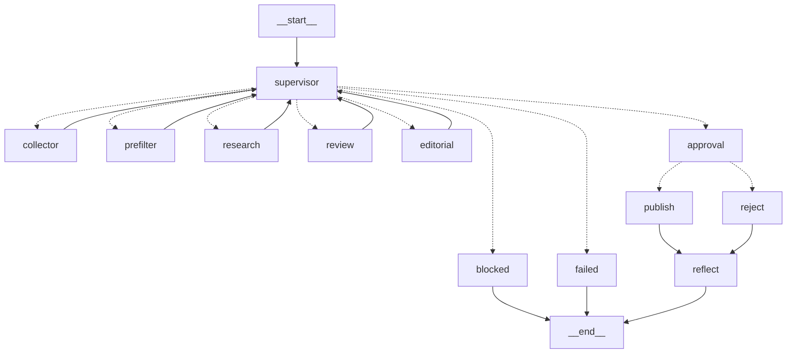
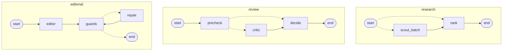
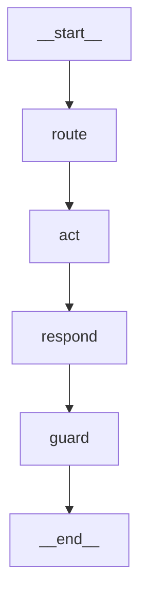

# LangGraph dans LLM Watch Harness

Ce document décrit **comment le projet utilise LangGraph** : les graphes, l'état, les patterns
(supervisor, map-reduce, boucles bornées, humain dans la boucle), la mémoire, le streaming, les
traces, et les pièges rencontrés. Versions utilisées : `langgraph` 1.2.12,
`langgraph-checkpoint-sqlite` 3.1.1.

> Les diagrammes ci-dessous sont générés par LangGraph lui-même
> (`graph.get_graph().draw_mermaid()`) ; `python -m app.main plan --langgraph` les réaffiche, et
> la page `/trace/<id>` de l'interface les colorie selon le parcours réel d'une réponse ou d'une veille.

## 1. Vue d'ensemble : quatre graphes

| Graphe | Fichier | Rôle |
|:--|:--|:--|
| Veille (principal) | `app/workflow/graph.py` | Supervisor + Task Graph, collecte, agents, validation humaine, publication, mémoire |
| `research` | `app/workflow/subagents.py` | Map-reduce de Scouts (un par lot de documents) |
| `review` | `app/workflow/subagents.py` | Pré-contrôle déterministe puis Critic LLM si nécessaire |
| `editorial` | `app/workflow/subagents.py` | Editor → guards → réparation bornée |
| Chat | `app/chat/agent.py` | route → act → respond → guard |

### Graphe de veille



Pointillés : routage conditionnel (`Command(goto=…)` ou `add_conditional_edges`). Traits pleins :
arêtes fixes. S'y ajoutent trois nœuds `__error_handler__research|review|editorial`.

### Sous-agents



### Graphe du chat



## 2. L'état

### Veille : `WatchState` (`app/workflow/state.py`)

`TypedDict` sérialisable en JSON (le checkpointer SQLite le persiste à chaque étape). Clés
principales : `plan` (Task Graph), `status`, `candidates`, `signals`, `critiques`, `accepted`,
`digest`, `violations`, `approval`, `note`, `outputs`, `options` (veille ciblée).

Trois réducteurs permettent aux tâches parallèles d'écrire sans conflit :

| Clé | Réducteur | Pourquoi |
|:--|:--|:--|
| `status`, `collected` | `merge_dicts` | chaque collecteur met à jour *sa* clé (`collect:rss`…) |
| `errors`, `trace` | `operator.add` | accumulation au fil du run |
| autres | remplacement | un seul écrivain à la fois |

### Contrats d'état

Chaque worker est décoré par `node_contract(Modèle)` : un modèle Pydantic `extra="forbid"`
décrit les clés qu'il a le droit d'écrire. Écrire une clé imprévue lève `GuardViolation`
immédiatement, au lieu de corrompre l'état en silence.

```python
@node_contract(PrefilterUpdate)          # status, candidates — rien d'autre
def prefilter(state: WatchState) -> dict: ...
```

### Sous-graphes : état séparé

Chaque sous-agent a **son propre schéma d'état** (`ResearchState`, `ReviewState`,
`EditorialState`) et est appelé depuis un **nœud d'adaptation** qui ne lui passe que ce dont il a
besoin et n'en extrait que le résultat. Voir le piège n° 1 plus bas.

## 3. Patterns

### Supervisor + Task Graph

Le plan est une donnée (`TaskGraph`, Pydantic) : ids uniques, dépendances existantes, pas de cycle
(tri topologique de Kahn). Le supervisor lit `status`, choisit les tâches prêtes et délègue :

```python
return Command(goto=[Send("collector", {"task": t.model_dump()}) for t in collectors],
               update={"status": {t.id: "running" for t in collectors}})   # fan-out
return Command(goto=task.agent, update={"status": {task.id: "running"}})   # délégation
```

`add_node("supervisor", supervisor, destinations=(...))` déclare les cibles possibles pour que le
diagramme les montre (sans effet à l'exécution).

### Patterns conditionnels bornés

| Où | Condition | Borne |
|:--|:--|:--|
| supervisor | trop peu de signaux acceptés → relance `research` avec un seuil abaissé | `MAX_REVIEW_ROUNDS` |
| `review` | aucun signal à juger après le pré-contrôle → saute le Critic | — |
| `editorial` | violations des guards → `repair` (réécriture avec corrections exigées) | `MAX_REPAIR_ROUNDS` |
| supervisor | tâche obligatoire en échec → `failed` ; violations → `blocked` | — |

Toute boucle a une borne explicite dans l'état, plus `recursion_limit=60` dans la config.

### Map-reduce (`research`)

```python
def fan_out(state):   # arête conditionnelle depuis START
    return [Send("scout_batch", {"start": i, "batch": docs[i:i+n], "memory": ...}) for i in ...]
```

Chaque `scout_batch` écrit dans `picks: Annotated[list, operator.add]` ; `rank` réduit.

### Humain dans la boucle

`approval` appelle `interrupt({...})` : le run s'arrête, l'état est dans `data/checkpoints.db`, et
la reprise (CLI `resume`, bouton de l'interface) envoie `Command(resume={"approved": ..., "note": ...})`
sur le même `thread_id`, éventuellement depuis un autre processus.

### Robustesse

| Mécanisme | Où |
|:--|:--|
| `RetryPolicy(max_attempts=2, retry_on=(httpx.TransportError, ConnectionError, TimeoutError))` | nœuds agents |
| `error_handler=agent_failed` → `Command(goto="supervisor", update={"status": {node: "failed"}})` | nœuds agents |
| `try/except` dans le nœud | collecteurs parallèles, lots de Scouts |
| `recursion_limit` | config de chaque run |

## 4. Mémoire

| Niveau | API LangGraph | Contenu |
|:--|:--|:--|
| Court terme | checkpointer `SqliteSaver` (`data/checkpoints.db`, `data/chat.db`) | état de chaque run, historique de chaque conversation (`thread_id`) |
| Long terme | `SqliteStore` (`data/memory.db`), injecté par `store: BaseStore` | leçons, thèmes, santé des sources (`app/memory.py`) |

Un nœud reçoit le Store simplement en déclarant le paramètre :

```python
def reflect(state: WatchState, store: BaseStore) -> dict:
    WatchMemory(store).add_lesson(state["note"], state["approval"], state["run_id"])
```

## 5. Streaming et traces

| Mode | Utilisé pour |
|:--|:--|
| `stream_mode="updates", subgraphs=True` | progression d'une veille, **y compris l'intérieur des sous-agents** (espace de noms `research:<id>`) |
| `stream_mode=["messages", "custom", "values", "updates"]` | chat : tokens du nœud `respond`, événements d'outil (`get_stream_writer()`), état final, parcours |

Chaque réponse du chat et chaque veille lancée depuis l'interface enregistrent leur parcours
(`graph`, `node`, durée, détail) dans la table `traces` (migration v4). La page `/trace/<id>`
affiche ce parcours et les diagrammes Mermaid, nœuds traversés en vert.

## 6. Pièges rencontrés (LangGraph 1.2.12)

1. **Sous-graphe comme nœud direct + réducteur `operator.add`** : le sous-graphe renvoie son état
   complet ; la liste partagée est ré-additionnée et double à chaque passage. En prototype, le
   processus a été tué (mémoire épuisée). ⇒ états séparés + nœud d'adaptation.
2. **`error_handler` et `Send` parallèles** : quand une tâche échoue alors que ses voisines
   réussissent, le handler n'est pas appelé et l'exception remonte. ⇒ isolation dans le nœud.
3. **Après un `error_handler`**, les arêtes du nœud en échec ne sont pas suivies : le handler doit
   router lui-même (`Command(goto="supervisor")`).
4. **Messages en double dans le streaming** : le mode `messages` réémet les messages renvoyés par
   un nœud. ⇒ renvoyer le message du modèle (même `id` que les tokens), pas une copie.
5. **Historique non contrôlé** : sans précaution, l'historique garde la réponse d'avant le guard.
   ⇒ le nœud `guard` remplace le message par sa version contrôlée (même `id`).

## 7. Recettes

### Ajouter une tâche au Task Graph
1. Ajouter l'agent à `AgentName` (`app/workflow/tasks.py`) et la tâche dans `default_plan`.
2. Écrire le nœud (+ son contrat d'état) dans `graph.py`, l'ajouter au builder et aux
   `destinations` du supervisor, avec une arête de retour vers `supervisor`.
3. Tester : `tests/test_components.py` (DAG) et `tests/test_graph.py` (parcours).

### Ajouter un outil au chat
1. Fonction dans `app/chat/tools.py` renvoyant un `ToolResult` (`sources`, `context` ou `direct`).
2. L'ajouter à `ToolName`, au prompt `router.md`, éventuellement à `RULES`, et à `TOOL_ENGAGEMENT`.
3. Tester dans `tests/test_chat.py` avec `GenericFakeChatModel`.

### Tester un graphe sans LLM
`InMemorySaver`, `InMemoryStore` et un `StructuredLLM` dont la fonction d'appel est simulée
(`tests/conftest.py::fake_ollama`) : le faux modèle répond selon le schéma demandé et les
identifiants présents dans le prompt.
