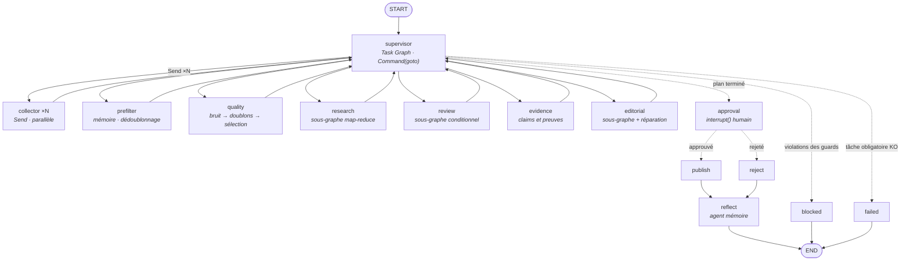
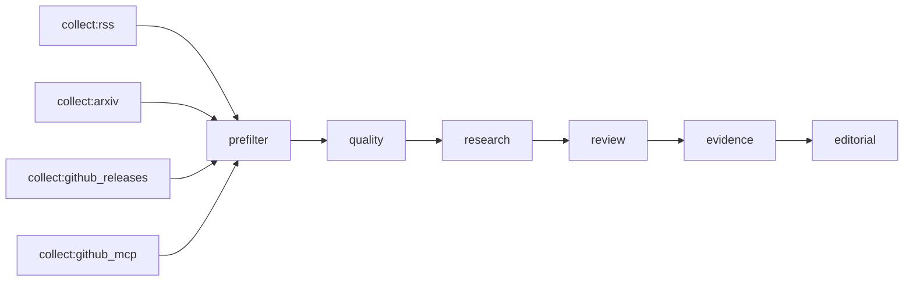
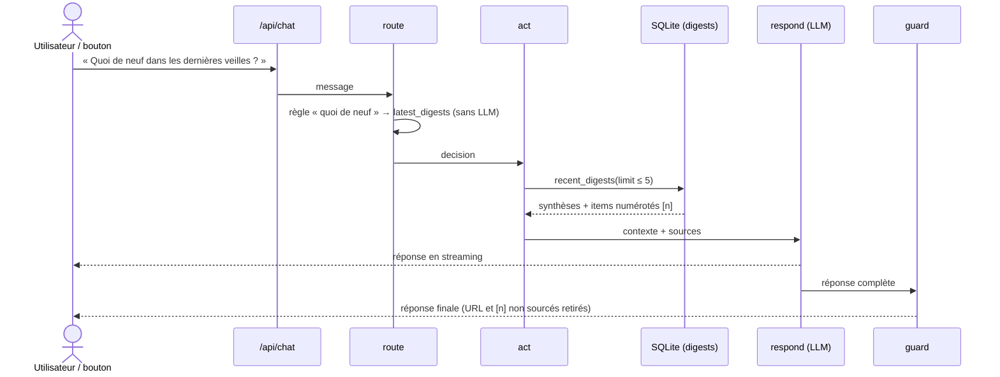

# Supervisor + Task Graph : le graphe de veille

Ce document décrit le schéma « en étoile » du graphe de veille : un **supervisor** au centre lit un
plan déclaratif (le **Task Graph**) et délègue chaque tâche à un nœud worker, qui lui rend la main.
Il décrit ensuite le parcours d'une question **« Quoi de neuf ? »**, qui lit les veilles produites
par ce graphe.

Code : `app/workflow/graph.py` (graphe et supervisor), `app/workflow/tasks.py` (Task Graph),
`app/workflow/subagents.py` (sous-graphes). Vue d'ensemble LangGraph : [langgraph.md](langgraph.md).

## 1. Le schéma en étoile

Traits pleins : délégation puis retour obligatoire au supervisor. Pointillés : sorties
conditionnelles. Le diagramme exact généré par LangGraph s'obtient avec
`python -m app.main plan --langgraph --out DOSSIER` (fichier `langgraph.mmd`). Il montre en plus
les nœuds `__error_handler__research|review|evidence|editorial`.

> Le nœud `quality` ne figure pas sur certaines captures plus anciennes du schéma : il se trouve
> entre `prefilter` et `research`.

## 2. Le Task Graph : le plan

Le plan est une **donnée validée par Pydantic** (`TaskGraph`), pas du code. Il est construit par
`default_plan()` :

| Champ de `Task` | Rôle |
|:--|:--|
| `id` | Identifiant unique (`collect:rss`, `research`…). |
| `agent` | Nœud qui exécute la tâche : `collector`, `prefilter`, `quality`, `research`, `review`, `evidence` ou `editorial`. |
| `deps` | Tâches qui doivent être terminées avant celle-ci. |
| `params` | Paramètres de la tâche (par exemple `{"source": "rss"}` pour un collecteur). |
| `optional` | Si `true`, l'échec de la tâche n'arrête pas le run. |

À la construction, le validateur vérifie que les ids sont uniques, que chaque dépendance existe et
qu'il n'y a pas de cycle (tri topologique de Kahn).

Statuts d'une tâche : `pending` → `running` → `done` | `failed` | `skipped`.

- Une tâche est **prête** quand elle est `pending` et que toutes ses dépendances sont terminées.
  Une dépendance en `failed` ne compte comme terminée que si elle est optionnelle.
- **Tâches optionnelles** :
  - les 4 collecteurs : une source en panne n'arrête pas la veille ;
  - `evidence` : en cas d'échec, l'Editor rédige sans faits structurés et la confiance est affichée
    « non évaluée ».
- Variantes du plan :
  - `run --no-collect` retire les collecteurs (`prefilter` n'a plus de dépendance) ;
  - `EVIDENCE_ENABLED=false` retire `evidence` (`editorial` dépend alors de `review`).

## 3. Les décisions du supervisor

À chaque passage, le supervisor teste ces conditions **dans cet ordre** et applique la première
qui est vraie :

| # | Condition | Décision |
|:--|:--|:--|
| 1 | Une tâche **non optionnelle** est en `failed` | `goto="failed"` |
| 2 | `review` est terminé, `editorial` est en attente, moins de `MIN_ACCEPTED` signaux acceptés, moins de `MAX_REVIEW_ROUNDS` tours effectués, et il reste des candidats non retenus | Relance `research` avec un seuil `min_relevance − 2` (minimum 3). `review` repasse en `pending`. |
| 3 | Aucune tâche prête et plan complet, avec des `violations` | `goto="blocked"` |
| 4 | Aucune tâche prête et plan complet, sans violation | `goto="approval"` |
| 5 | Des tâches `collector` sont prêtes | **Fan-out parallèle** : un `Send("collector", {task})` par source |
| 6 | Sinon | **Délégation séquentielle** à la première tâche prête |

Si aucune tâche n'est prête alors que le plan n'est pas complet, le supervisor lève
`RuntimeError("Task Graph bloqué")`. C'est une erreur de conception du plan, pas un cas normal.

Chaque décision ajoute une ligne à `trace`, par exemple « fan-out : collect:rss, … » ou
« délègue research → research ». Ces lignes sont visibles sur la page `/trace/<id>`.

## 4. Les nœuds

### Workers (retour au supervisor)

Chaque worker est décoré par `@node_contract(XxxUpdate)` : écrire une clé d'état non prévue lève
`GuardViolation`.

| Nœud | Ce qu'il fait | LLM |
|:--|:--|:--|
| `collector` | Exécute une source et enregistre les documents en SQLite. L'échec est isolé (seule cette tâche passe en `failed`) et la santé de la source est mémorisée. | non |
| `prefilter` | Écarte les documents déjà publiés, les titres en double, ceux trop anciens (`--max-age`) et ceux hors mots-clés (`-k`). Équilibre les sources en tourniquet. Pool : `MAX_DOCUMENTS_PER_RUN × QUALITY_POOL_FACTOR`. | non |
| `quality` | Sous-graphe `noise → dedup → select` : bruit, quasi-doublons (`DEDUP_THRESHOLD`), puis les `MAX_DOCUMENTS_PER_RUN` premiers. | non |
| `research` | Sous-graphe map-reduce : un Scout par lot de `SCOUT_BATCH_SIZE` documents, puis ranking hybride et sélection diversifiée (`MAX_SIGNALS`, `DIVERSITY_PENALTY`). | oui |
| `review` | Sous-graphe `precheck → (critic) → decide` : une date future est rejetée sans appel LLM, et le Critic n'est appelé que s'il reste des signaux à juger. | oui, si nécessaire |
| `evidence` | Sous-graphe `claim_extract → claim_ground → cross_source_verify → contradiction_detect → evidence_score`. | oui (`claim_extract` seulement) |
| `editorial` | Sous-graphe `editor → guards → (repair)*`, dans la limite de `MAX_REPAIR_ROUNDS` réparations. | oui |

Les quatre nœuds qui appellent le LLM (`research`, `review`, `evidence`, `editorial`) ont :
- une `RetryPolicy` de 2 essais sur les erreurs réseau ou les timeouts ;
- un `error_handler` qui transforme l'exception en `status=failed` et rend la main au supervisor,
  au lieu de faire planter le run.

### Fin de run

| Nœud | Ce qu'il fait | Statut du run |
|:--|:--|:--|
| `approval` | `interrupt()` : présente le digest en Markdown et attend `resume <run_id> --approved\|--rejected --note "…"`. L'étape est sautée si la validation humaine est désactivée (`run --approve`). | `awaiting_approval` |
| `publish` | Valide le `Digest` avec Pydantic, écrit les fichiers, le rapport daté et la page Notion (si activée), puis archive les claims. | `published` |
| `reject` | Enregistre le rejet. | `rejected` |
| `reflect` | Agent mémoire : enregistre la leçon et le feedback, renforce (+1) ou affaiblit (−1) les tags, suggère des règles après des rejets récurrents, exporte `.claude/memory/veille.md`. | — |
| `blocked` | Les guards ont bloqué la publication (URL inconnue, chiffre non sourcé…). | `blocked` |
| `failed` | Une tâche obligatoire a échoué. | `failed` |

## 5. Les étapes d'un « Quoi de neuf ? »

« Quoi de neuf ? » **ne relance pas** le graphe de veille. C'est une question posée au **chat**
(graphe `route → act → respond → guard`, `app/chat/agent.py`). Le chat répond à partir des
**digests déjà publiés** par le nœud `publish` ci-dessus.

On déclenche la question de trois façons :
- en la tapant dans le chat ;
- avec la suggestion « Quoi de neuf ? » de l'écran d'accueil ;
- avec le bouton physique (Zigbee2MQTT → `app/button.py` → flux SSE `/api/live`), qui l'envoie
  dans chaque onglet ouvert.

1. **Déclenchement** : le message arrive sur `POST /api/chat`. La conversation est un thread du
   checkpointer (`chat-<conversation_id>`).
2. **`route`** : les règles déterministes passent avant le LLM. Le motif
   `quoi de neuf | dernières veilles | derniers digests | résume la veille | nouveautés` choisit
   l'outil `latest_digests` (`routed_by = "rule"`, aucun appel au routeur LLM).
3. **`act`** : l'outil `latest_digests` lit les dernières veilles publiées dans la table `digests`
   (3 par défaut, 5 au maximum). Il construit :
   - un contexte : synthèse de chaque veille, puis ses items numérotés `[n]` avec leur résumé et
     « Pourquoi » ;
   - la liste des sources : titre, URL, source, date.

   S'il n'existe encore aucune veille publiée, l'outil renvoie directement une réponse fixe qui
   propose « lance une veille ».
4. **`respond`** : le modèle de chat reçoit le prompt système (`chat`, avec la mémoire de veille)
   et les 6 derniers échanges (`ChatContext.history_turns`). Il répond en streaming, **uniquement** à partir
   de ce contexte.
5. **`guard`** :
   - retire toute URL absente des sources (« [lien retiré] ») et toute citation `[n]` hors plage ;
   - stocke la version contrôlée dans l'historique, pour qu'une URL retirée ne revienne pas au tour
     suivant.
6. **Affichage** : la réponse s'affiche avec ses sources, la durée de chaque nœud et ce qui a été
   sollicité (outil `latest_digests`, donnée « digests publiés »).

Pour obtenir de **nouvelles** actus, il faut d'abord produire une veille : « lance une veille »
dans le chat (outil `run_watch`, éventuellement ciblé : « lance la veille sur vLLM, Qwen »),
`python -m app.main run` ou le cron quotidien. Le run suit le Task Graph décrit plus haut et
s'arrête à `approval`. Une fois approuvé et publié, le digest devient visible pour le prochain
« Quoi de neuf ? ».

## 6. Ajouter une tâche au plan

1. Ajouter le nom de l'agent dans `AgentName` (`tasks.py`) et la `Task` dans `default_plan()`,
   avec ses `deps`.
2. Écrire le nœud worker décoré par `@node_contract(...)`, avec son modèle de mise à jour dans
   `state.py`.
3. Déclarer le nœud :
   - `add_node(...)` ;
   - l'arête de retour `worker → supervisor` ;
   - la cible dans `destinations=` du supervisor.
4. Expliquer le nœud dans la page `/howto` (test `test_howto_page_and_generated_diagrams`), puis
   mettre à jour ce document et [langgraph.md](langgraph.md).
